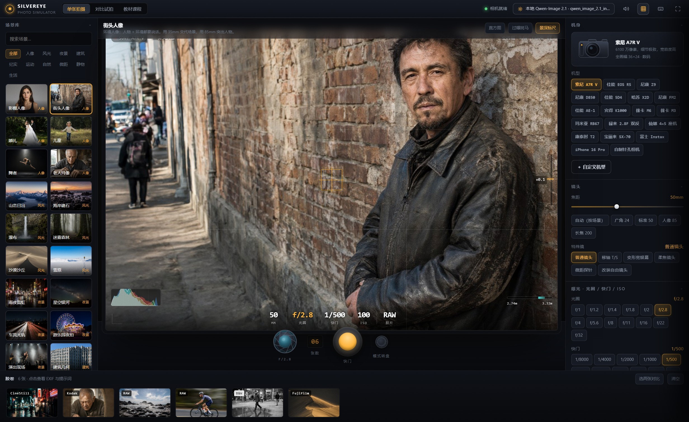
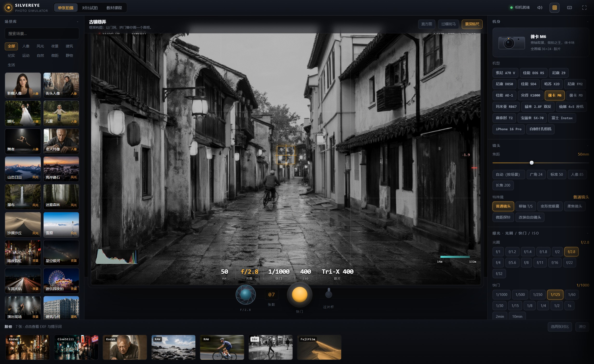
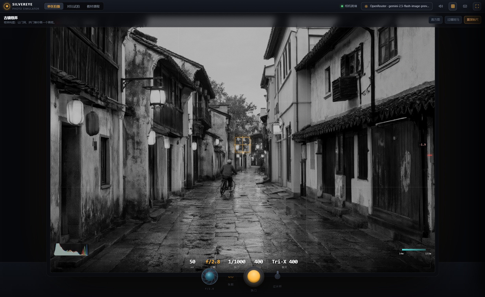
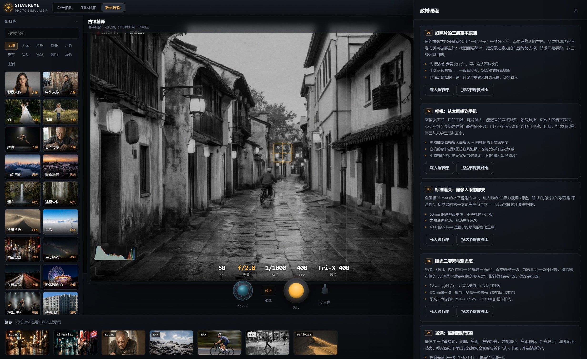
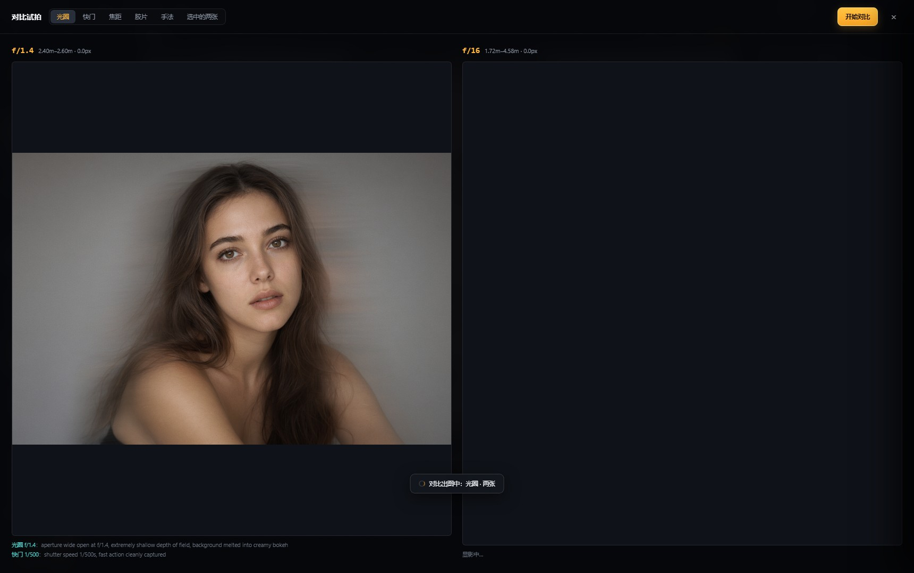
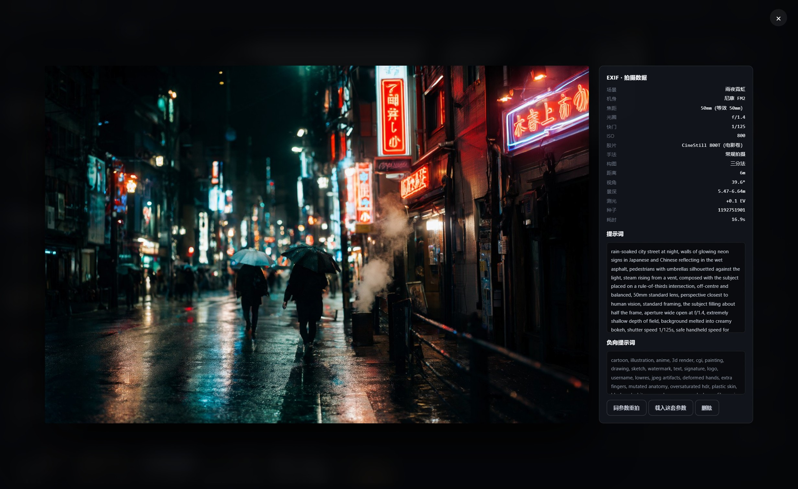
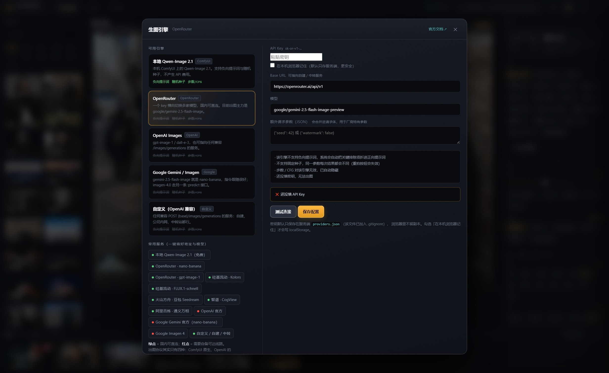
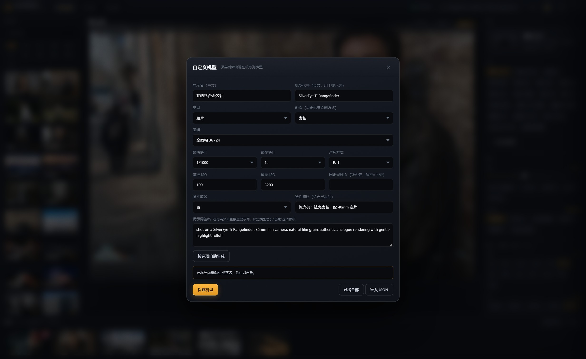
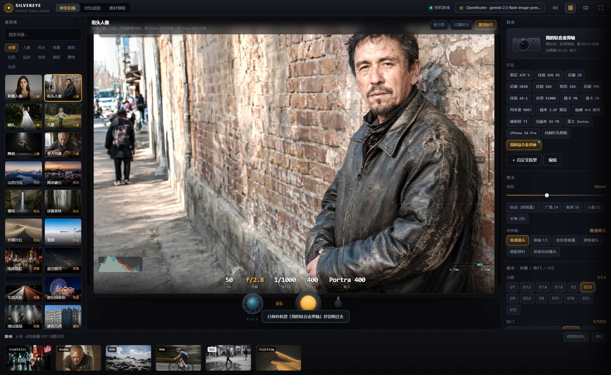

# SilverEye · 沉浸式摄影模拟器

> 仓库：<https://github.com/sprookie/SilverEye>

一个"拿在手里"的摄影模拟器：你调机身、换镜头、拧光圈、拨快门、卷胶片，
取景器会**实时**按真实光学公式重新模拟画面，按下快门后由 Qwen-Image 2.1
把你这一整套参数"翻译"成一张照片。

它同时是一套教学工具 —— 课程脉络对齐《美国纽约摄影学院摄影教材》，
从"好照片的三条原则"一直讲到高感光颗粒与专题训练。



---

## 快速开始

```bash
git clone https://github.com/sprookie/SilverEye.git
cd SilverEye

# 1. 先确保 ComfyUI 在跑（默认 127.0.0.1:8000，已加载 Qwen-Image 2.1 权重）
# 2. 双击 start.bat，或者：
F:\.venv\Scripts\python.exe server.py

# 3. 浏览器打开 http://127.0.0.1:8770
```

要求：Python 3.10+、`fastapi` / `uvicorn` / `requests`；
ComfyUI + `qwen_image_2.1_int8_convrot` 三件套（unet / clip / vae）。

> 不想装 ComfyUI 也行 —— 点顶栏的「生图引擎」换成云端 API 就能用（见下）。

> 仓库里已经带了 33 张场景底图和 6 张演示作品，clone 下来就能直接用。
> 想换一套场景底图跑 `scripts/seed_scenes.py` 重新生成即可。

---

## 生图引擎：本地 + 云端，随便换

顶栏中间的按钮可以切换出图后端。**协议其实只有四种**，
所以一个适配器就能覆盖一大票服务：

| 引擎 | 协议 | 负向提示词 | 固定种子 | 国内直连 |
|---|---|---|---|---|
| **本地 Qwen-Image 2.1**（默认） | ComfyUI 原生 | ✅ | ✅ | ✅ 免费 |
| **OpenRouter** | chat + `modalities:["image"]` | — | — | ✅ |
| **OpenAI Images** | `POST /images/generations` | — | — | ❌ 需中转 |
| **Google Gemini / Imagen** | `:generateContent` / `:predict` | — | — | ❌ 需中转 |
| **自定义（OpenAI 兼容）** | 同上第一条 | — | — | ✅ 自建 |

内置 12 个**一键预设**，其中标注了国内可达性：

- 🟢 硅基流动 Kolors / FLUX.1-schnell、火山方舟豆包 Seedream、智谱 CogView、阿里百炼万相
- 🟢 OpenRouter（nano-banana / gpt-image-1）
- 🔴 OpenAI 官方、Google Gemini 官方、Imagen 4

**引擎能力差异会被自动降级处理**，不会因为参数对不上就报错：

- 不支持负向提示词的引擎 → 关键排除项自动折进正向（`Strictly avoid depicting: ...`）
- 不支持固定种子的引擎 → 丢弃种子，并在面板上提示"重拍按钮会失效"
- 固定尺寸的引擎 → 把当前画幅比**吸附到最接近的合法尺寸**
  （gpt-image-1 认 1024²/1536×1024/1024×1536；dall-e-3 认 1792×1024 系；
  豆包、Kolors、CogView、万相各有各的尺寸表）
- 提示词过长 → 按引擎上限截断

**密钥只进不出**：默认保存在服务端 `providers.json`（已 gitignore），
`GET /api/config` 只回 `has_key` 标记、绝不回明文；浏览器里不留副本。
只有主动勾选「在本机浏览器记住」才会写 localStorage。

「测试连接」是**免费预检**：本地引擎查 `/system_stats`，
OpenAI 兼容端点查 `/models`，Gemini 查 `/models`，OpenRouter 查 `/key`
（还能顺带把余额读出来）。

---

## 自定义相机

右侧「机身」区块底部有「＋ 自定义机型」。可定义：

- **类型**：数码 / 胶片 / 即时成像
- **形态**：单反 / 无反 / 旁轴 / 双反 / 座机 / 傻瓜机 / 拍立得 / 手机 / 针孔
  —— 决定机身在界面上怎么画（SVG 造型跟着变）
- **画幅**：从 8 种内置画幅里挑，或自定义「感光面宽 + 画幅比」
  （弥散圈留空则按 `对角线/1730` 自动推算，与内置值基本吻合）
- **快门范围 / ISO 范围 / 过片方式 / 固定光圈**（针孔机用得上）
- **提示词签名**：这句英文直接进提示词，决定模型怎么"想象"这台相机。
  能按选项一键生成，也能手写

实测：从零建一台「钛合金旁轴」→ 刷新后仍在 → 用它拍一张 19.4 秒出图，
提示词里正确出现 `shot on a SilverEye Ti Rangefinder, 35mm film camera, natural film grain...`。

支持导出 / 导入 JSON，方便换机器或分享机型。

---

## 它到底在做什么

### 1. 提示词工程引擎（`web/js/engine.js`）

每一次快门，都会把 10 组参数按固定顺序组装成一段英文提示词：

```
主体与环境 → 摄影手法 → 构图 → 镜头+取景范围 → 光圈+景深
→ 快门+运动 → 曝光补偿 → 感光材料 → 光线 → 闪光 → 滤镜 → 机身 → 画质
```

右侧面板里那段彩色文字就是**实时拼出来的提示词**，鼠标悬停能看到每一段
来自哪个旋钮。负向提示词也会跟着变——选了黑白胶片，就自动把
`colour, colorful, saturated color` 加进负向；选了慢门，就不再压制运动模糊。

> 关键设计：焦距不能只丢一个 `50mm` 给模型，模型会无视它。
> 所以引擎会把焦距换算成 135 等效焦距，再翻译成一句取景描述，
> 比如 `standard framing, the subject filling about half the frame`。
> 这是让"取景器里看到的构图"和"生成出来的构图"对得上的一半原因。

### 2. 真实光学计算（不是装饰）

取景器里所有数字都是算出来的，不是查表：

| 量 | 公式 |
|---|---|
| 水平视角 | `2·atan(W_sensor / 2f)` |
| 超焦距 | `H = f² / (N·c) + f` |
| 景深近/远 | `s(H−f)/(H+s−2f)` 与 `s(H−f)/(H−s)` |
| 测光偏差 | `log₂(N²/t) − log₂(ISO/100) − EV_scene` |
| 运动位移 | `速度 × 快门 × 焦距 ÷ 距离 ÷ 像元尺寸`（像素） |

弥散圈 `c` 随画幅变化（全画幅 0.029mm、6×6 是 0.053mm、4×5 是 0.10mm），
所以同一支 80mm 装在 135 和装在 6×6 上，景深、视角、透视全是两回事。

例：50mm f/2.8 对焦 3m，全画幅 → 景深 2.74–3.32m、超焦距 31m。
改到 f/16 → 景深变成 1.94–6.63m。面板上都会实时跳。

**滤镜是真的会减光的**：挂上 ND1000 就是 −10 级，`场景有效 EV` 直接减 10，
测光表和"自动测光"都会跟着变。CPL −1.5 级、ND8 −3 级、渐变灰 −1 级。

### 3. 自动焦距 / 自动测光

按下 `A`（或镜头区的"自动（按场景）"）：按场景类别给一个 135 等效焦距，
再折回你当前画幅的真实焦距并吸附到最接近的那支镜头 —— 山峦日出 → 24mm，
野生动物 → 400mm，棚拍人像 → 85mm。

按下 `E`（或快门区的"自动测光"）：按真实测光算出一个正确曝光的快门。

### 4. 取景器模拟

底图是 33 张按 35mm 取景范围生成的场景照（1536×1024），取景器对它们做四件事：

- **焦距缩放** —— 按 `tan(基准视角/2) / tan(当前视角/2)` 真实裁切（等价于焦距比）
- **景深虚化** —— 以对焦点为中心向外逐渐模糊，模糊量由 `景深/拍摄距离` 决定
- **曝光** —— 按测光偏差 + 曝光补偿直接推亮度，过曝时刷斑马纹
- **胶片风格** —— 每种胶片有自己的饱和度/色相偏移 LUT；黑白卷直接上 `grayscale`

再加颗粒、暗角、手持抖动（快门慢于 1/等效焦距就抖）。

---

## 器材库

- **机身 18 台**：索尼 A7R V、佳能 R5、尼康 Z9/D850、哈苏 X2D、尼康 FM2、
  佳能 AE-1、宾得 K1000、徕卡 M6/M3、玛米亚 RB67、禄来 2.8F 双反、
  仙娜 4×5 座机、康泰时 T2、宝丽来 SX-70、富士 Instax、iPhone、针孔相机
- **镜头 14 档** 8mm 鱼眼 → 500mm 折返，另有移轴 / 变形宽银幕 / 柔焦 / 探针 / 自由镜头
- **光圈 13 档** f/1.0 → f/32，叶片数随光圈变化（9 片 → 6 片），叶片开合是动画
- **快门 21 档** 1/8000 → 10 分钟 B 门，**按机身能力过滤**（FM2 不会出现 1/8000）
- **胶片 30 种**：柯达 Portra 160/400/800、Ektar 100、Gold 200、Tri-X、T-Max、
  Ektachrome；富士 Velvia 50、Provia、Pro 400H、Superia、Acros；
  依尔福 HP5、Delta 100/3200、Pan F；CineStill 800T、Vision3；
  上海 GP3；宝丽来 SX-70/600、Instax
- **手法 28 种**：摇拍、凝固、慢门拖影、长曝、光绘、星轨、变焦拉爆、ICM、
  多重曝光、频闪、景深合成、剪影、逆光、伦勃朗光、蝴蝶光、三点布光…
  （选了"摇拍"会自动把快门设成 1/30）
- **滤镜 13 种**、**闪光 8 种**、**构图 12 种**、**场景 33 个**

---

## 三种模式

| 模式 | 用途 |
|---|---|
| **单张拍摄** | 正常取景 → 按快门 → 出图 |
| **对比试拍** | 选定一个变量（光圈/快门/焦距/胶片/手法），其余参数自动对齐，一次出两张并**高亮提示词里改变了的那几段**。也可在胶卷里手选两张做对比 |
| **教材课程** | 16 节课，每节可"载入这节课"或"按这节课做对比"（自动配好场景与对比维度） |

对比模式会自动重算快门来抵消曝光差异，让两张图只体现**你指定的那一个变量** ——
不然 f/1.4 和 f/16 直接对比，一张过曝一张欠曝，就学不到景深了。

---

## 快捷键

`空格` 快门 · `F` 沉浸取景 · `G` 辅助线 · `C` 对比 · `L` 课程
`A` 自动焦距 · `E` 自动测光
`1–9` 快速配方 · `←→` 焦距 · `↑↓` 光圈 · `[ ]` 快门 · `Esc` 关浮层

---

## 界面

| | |
|---|---|
|  |  |
| 换胶片 → 取景器立刻转黑白，计数器与过片杆跟着变 | `F` 进入沉浸取景，只剩画面和读数 |
|  |  |
| 16 节课，每节可"载入"或"按这节课做对比" | 对比试拍，下方高亮提示词里改变的那几段 |
|  |  |
| 每张照片都有完整 EXIF 与当初那段提示词 | 内置 6 张演示作品（`docs/` 里另有提示词跟随测试） |
|  |  |
| 5 种引擎 + 12 个常用服务预设，能力差异自动降级 | 自定义机型：形态、画幅、快门范围、提示词签名 |
|  | |
| 存下来的机型直接出现在机身列表（带青色小点标记） | |

---

## 文件结构

```
photo-sim/
├── server.py                 FastAPI：静态托管 + /api/shot + /api/providers
│                             + /api/provider/probe + /api/config + /api/gallery
├── qwen_core.py              直连 ComfyUI 的生图核心（绕过系统代理）
├── providers/                ★ 多厂商生图适配层
│   ├── base.py               能力声明 / 尺寸吸附 / 负向降级 / 密钥脱敏 / 错误中文化
│   ├── comfy_qwen.py         本地 Qwen-Image 2.1（负向 + 种子全支持）
│   ├── openai_images.py      OpenAI Images 协议 + OpenRouter（一个文件覆盖一大票服务）
│   ├── gemini_image.py       Gemini nano-banana（:generateContent）与 Imagen（:predict）
│   └── registry.py           注册表 + 12 个常用服务预设
├── start.bat                 一键启动
├── scripts/
│   ├── seed_scenes.py        批量生成 33 张场景底图（1536×1024）
│   ├── seed_demo.py          生成 6 张演示作品并写进画廊索引
│   ├── smoke_test.py         生图链路自检
│   ├── test_providers.py     ★ 多引擎离线单测（不需要 API Key，60 项断言）
│   ├── e2e_check.js          端到端交互 + 真快门验证（本机 Chrome）
│   └── e2e_shots.js          重拍 docs/ 下的界面截图
├── docs/                     界面截图 + 提示词跟随测试样张
└── web/
    ├── index.html
    ├── css/  base.css · camera.css · kit.css（弹窗 / 引擎面板 / 机型表单）
    ├── js/   catalog.js     器材数据库
    │         scenes.js      场景 / 手法 / 构图
    │         engine.js      提示词工程 + 光学计算
    │         customgear.js  ★ 自定义相机：翻译成机身记录 + 编辑器 UI
    │         providers.js   ★ 生图引擎面板：预设 / 能力提示 / 预检 / 密钥策略
    │         viewfinder.js  取景器 / 光圈叶片 / 机身 SVG / 快门帘
    │         audio.js       WebAudio 合成相机音效（无音频文件）
    │         gallery.js     胶卷条 / 灯箱 / 对比视图
    │         lessons.js     16 节课 + 12 套快速配方
    │         app.js         主控
    └── assets/
        ├── scenes/          33 张场景底图（Qwen-Image 生成，1536×1024）
        ├── gallery/         你拍的照片 + index.json
        └── samples/         最早的三张提示词跟随探针（浅景深 / 摇拍 / 长曝）
```

重新生成素材：

```bash
F:\.venv\Scripts\python.exe scripts/seed_scenes.py          # 33 张底图，约 12 分钟
F:\.venv\Scripts\python.exe scripts/seed_scenes.py neon-night   # 只重做指定场景
F:\.venv\Scripts\python.exe scripts/seed_demo.py            # 6 张演示作品
F:\.venv\Scripts\python.exe scripts/test_providers.py       # 多引擎单测（离线，秒级）
```

---

## API

```bash
# 后端状态
curl http://127.0.0.1:8770/api/status

# 出图（提示词由前端组装好后 POST 过来）
curl -X POST http://127.0.0.1:8770/api/shot \
  -H "Content-Type: application/json" \
  -d '{"prompt":"...","negative_prompt":"...","width":1152,"height":768,
       "steps":25,"cfg":1.0,"seed":-1,"meta":{"任意":"元数据"}}'
```

`POST /api/shot` 会把结果落到 `web/assets/gallery/` 并写进索引；
`GET /api/gallery` 列全部，`DELETE /api/gallery/{id}` 删一张。

---

## 踩过的坑

**1. 系统代理会拦掉本机请求。**
如果环境里有 `http_proxy` / `https_proxy`，`requests` 连 `127.0.0.1:8000`
也会走代理，报 `upstream connect failed: 目标计算机积极拒绝`。
`qwen_core.py` 里所有 session 都设了 `trust_env = False`，`start.bat`
也会清掉代理变量。从命令行调试时别忘了 `curl --noproxy '*'`。

**2. 测光表的符号极容易写反。**
`evSet = log2(N²/t) − log2(ISO/100)` 衡量的是"**这组参数挡掉了多少光**"，
不是"画面有多亮"。所以：

```
偏差 = 场景有效EV − evSet      // >0 才是过曝
```

一开始写成 `evSet − 场景EV`，结果 f/16 + 1/500 在晴天显示 +5 EV（其实是 −5）。
景深和视角算对了不代表测光也对了，这三个要分别验算。

**3. 画面比例必须和机身绑定。**
6×6 双反出正方形、4×5 出 5:4，生成时按机身画幅算高度，
不然取景器里的正方形框和生成出来的 3:2 图对不上。

**4. 对比模式一定要自动对齐曝光。**
只改一个变量、其余全部重算，是"对比试拍"能用来教学的前提。

**5. 切场景不能重置用户的创作决定。**
一开始切场景会调用 `stateFor()` 把机身、胶片、手法全刷一遍，
用户好不容易选好的 Tri-X 一换场景就没了。
拆成 `switchBody()`（换机身才动感光材料/镜头）和 `switchScene()`（只改拍摄距离），
再用 `keepExposure()` 把偏差拉回 ±2 级以内。

`keepExposure()` 这里还有一层：**如果当前手法锁住了快门**（比如"追随拍摄"必须是 1/30），
就不该改快门去迁就曝光，而应该改光圈 —— 这才是摄影师在暗处会做的事。
实测：从街拍切到雨夜霓虹，f/16 自动开到 f/2，快门仍是 1/30，测光回到 +0.1 EV。

**6. 各家生图 API 的响应结构没有任何标准。**
同样是"返回一张图"，实测拿到的形态有：
`data[0].b64_json`、`data[0].url`、
`candidates[0].content.parts[].inlineData.data`、
`predictions[].bytesBase64Encoded`、
`choices[0].message.images[].image_url.url`、
以及 `message.content` 直接是数组、里面夹 `image_url`。
**硬编码路径一定会碎**，所以 `parse_response` 写成"先按已知路径取，取不到再递归找关键字段"，
并且每种形态都有单测覆盖。

**7. 不要假设"支持生图"就等于"支持负向提示词和种子"。**
OpenAI / Gemini / OpenRouter 都不支持负向提示词，也都不支持固定种子。
如果不管这些差异直接发请求，用户会收到一堆莫名其妙的参数错误。
做法是让每个引擎声明 `caps`，由基类统一降级 ——
把负向折进正向、丢掉种子、把画幅比吸附到合法尺寸。

---

## 验证方式

**1）多引擎离线单测**（不需要任何 API Key，秒级跑完）

```bash
F:\.venv\Scripts\python.exe scripts/test_providers.py     # 60 项断言
```

每个 provider 的 `build_request()` 与 `parse_response()` 都是纯函数，
所以请求体结构和各家五花八门的响应解析可以完全离线验证 ——
这正是"多厂商适配"最容易出错、也最该被测住的地方。
覆盖：URL / 鉴权头 / 请求体字段、各家不同的响应嵌套
（`data[0].b64_json`、`candidates[].content.parts[].inlineData`、
`predictions[].bytesBase64Encoded`、`choices[0].message.images[]`）、
安全策略拦截、能力降级、密钥脱敏。

**2）浏览器端到端**（本机 Chrome + `playwright-core`，不下载浏览器内核）

```bash
cd photo-sim
F:\.venv\Scripts\python.exe server.py &
NODE_PATH=<node workspace>/node_modules node scripts/e2e_check.js            # 交互检查
NODE_PATH=<node workspace>/node_modules node scripts/e2e_check.js http://127.0.0.1:8770/ shoot   # 连真快门
NODE_PATH=<node workspace>/node_modules node scripts/e2e_shots.js            # 重拍 docs/ 截图
```

脚本会收集 console 报错、改光圈、换机身与胶片、选手法、切场景、
真按一次快门，抓到 EXIF 并逐张截图。

**本次验证结果**：0 个 JS 报错；本地引擎出图 16.9–25.2 秒（1408 宽 / 25 步）；
50mm f/2.8 对焦 3m 时景深 2.74–3.32m、超焦距 31m，与手算一致；
自定义机型从建到出图全链路通过。

一个顺手验出来的 bug：测光表符号写反了（见下），
是靠"f/16 + 1/500 拍晴天应该欠曝，脚本却打出 +5 EV"抓到的 ——
**景深和视角算对了，不代表测光也对了，这三件事要分别验算。**

---

## 环境实测数据

| 项目 | 数值 |
|---|---|
| ComfyUI | 0.37.0 @ `127.0.0.1:8000` |
| 权重 | `qwen_image_2.1_int8_convrot` + `qwen3vl_8b_int8_convrot` + `qwen_image_2.1_vae_bf16` |
| 显卡 | RTX 3090 24G |
| 1152×768 / 25 步 / cfg 1.0 | 约 11–13 秒 |
| 1536×1024 / 25 步 / cfg 1.0 | 约 22 秒（显存余量仍剩 8.8 GB） |
| 出图尺寸（本项目默认） | 1408 宽，按机身画幅算高，对齐到 32 的倍数 |

---

## 可以继续做的事

- 把 `/edit` 接进来（`TextEncodeQwenImage21` 支持最多 16 张参考图），
  就能实现"换胶片重曝同一张底片"
- 加曝光包围（BKT）一次出 3 张不同曝光
- 把 EXIF 写成真正的 sidecar 文件，导出成 Lightroom 可读
- 课程内容继续扩到教材后半本：暗房、放大机、彩色校正、输出装裱
